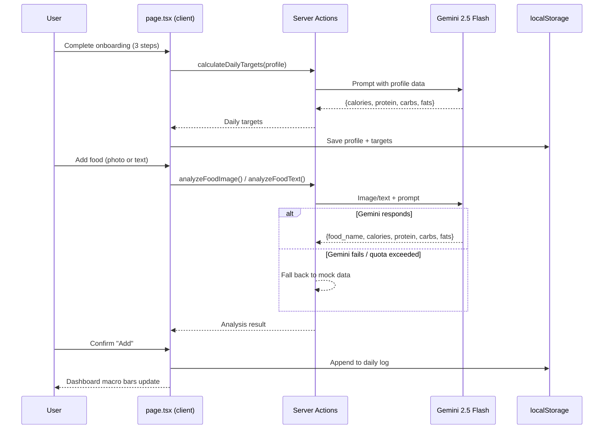
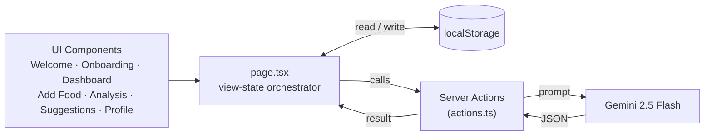

# Nutrino — AI Food & Nutrition Tracker

Nutrino turns a photo or a text description of a meal into full nutritional breakdown — no manual macro lookup, no barcode scanning. Point your camera at your food, or type what you ate, and Gemini identifies it and returns calories, protein, carbs, and fats in seconds. Onboarding also uses AI to calculate personalized daily targets (BMR/TDEE) from your profile, so the whole app adapts to you from the first screen.

**Stack:** Next.js · TypeScript · Tailwind CSS · Google Gemini 2.5 Flash

---

## Why This Project

Most nutrition trackers rely on massive manual food databases that are tedious to search and often out of date. Nutrino skips the database entirely — Gemini *is* the food database. Snap a photo, get macros. This also made it possible to build and ship a fully working product as a solo side project, with zero backend infrastructure to stand up or maintain.

---

## How It Works

1. **Onboarding** — user answers a 3-step flow (basics, goals, environment); the collected profile is sent to Gemini, which calculates BMR/TDEE and returns personalized daily calorie/macro targets
2. **Log a meal** — user either takes/uploads a photo or types a text description
3. **Analyze** — the image or text is sent to a server action, which prompts Gemini to identify the food and return `{food_name, calories, protein, carbs, fats}`
4. **Review & save** — the result is shown for confirmation, then saved into that day's log
5. **Suggestions** — on request, Gemini generates meal suggestions filtered by preference (e.g. "High Protein"), and can expand any suggestion into a full recipe with ingredients and steps
6. **Dashboard** — daily macro bars update live against the personalized targets from onboarding

Every AI call follows the same resilience pattern: build prompt → call Gemini → parse JSON → **on any failure, fall back to mock data** rather than crashing or showing an error.



---

## Architecture

There's no separate backend service and no database — Next.js Server Actions **are** the backend, and the browser's `localStorage` **is** the database.



**"Routing" without routes:** the app is a single page (`app/page.tsx`) with no file-based Next.js routing. A `view` state variable (`welcome`, `onboarding`, `dashboard`, `add_food`, `analysis_page`, `suggestions`, `meal_details`, `notifications`, `profile`, `manual_entry`) decides what renders, and every component is "dumb" — it takes props and fires callbacks, with all state and logic centralized in `page.tsx`.

---

## Key Engineering Decisions

| Decision | Why |
|---|---|
| **Server Actions instead of a REST API** | `'use server'` functions in `actions.ts` run only on the server — the `GEMINI_API_KEY` never reaches the browser, with none of the boilerplate of standing up `/api` routes |
| **Gemini as the only external dependency** | Every "smart" feature — food analysis, meal suggestions, recipe details, BMR/TDEE calculation — is a single Gemini prompt, instead of maintaining a nutrition database |
| **Mock-data fallback on every AI call** | If Gemini is down, rate-limited, or returns malformed JSON, the app returns hardcoded fallback data instead of crashing — the user experience degrades gracefully rather than breaking |
| **`view`-state routing instead of file-based routes** | The whole app is one client component; simpler state management for a fast-moving solo project, at the cost of no deep-linkable URLs |
| **localStorage instead of a database** | Zero backend infra to run or pay for while validating the product — Supabase env vars already exist in `.env` for when persistence needs to move server-side |
| **Client-side image resize before upload** | `imageUtils.ts` downscales photos to 1024px / JPEG quality 0.8 via canvas before they're sent to the server action, cutting upload size and Gemini image-token cost |

---

## Server Actions

| Function | Called From | What It Does |
|---|---|---|
| `analyzeFoodImage()` | `AddFoodChoice` | Sends a resized photo to Gemini → returns food name + macros |
| `analyzeFoodText()` | `AddFoodChoice` | Sends a text description to Gemini → returns food name + macros |
| `generateMealSuggestions()` | `page.tsx` → `MealSuggestions` | Returns 2 AI meal suggestions filtered by preference (e.g. Balanced, High Protein) |
| `generateMealDetails()` | `MealDetails` | Returns full recipe (ingredients + steps) for a chosen meal |
| `calculateDailyTargets()` | `page.tsx`, on onboarding completion | Calculates BMR/TDEE and daily calorie/macro targets from the user's profile |

---

## Project Structure

```
nutrino/
├── app/
│   ├── layout.tsx        # Root shell 
│   ├── page.tsx           # Central orchestrator 
│   ├── actions.ts          # Server Actions 
│   └── globals.css
├── lib/
│   └── imageUtils.ts       
└── components/
    ├── WelcomeScreen.tsx
    ├── onboarding/
    │   ├── OnboardingFlow.tsx
    │   ├── Step1Basics.tsx
    │   ├── Step2Goals.tsx
    │   └── Step3Environment.tsx
    ├── Dashboard.tsx
    ├── AddFoodChoice.tsx
    ├── AnalysisPage.tsx
    ├── AnalysisResultModal.tsx
    ├── ManualEntry.tsx
    ├── MealSuggestions.tsx
    ├── MealDetails.tsx
    ├── Notifications.tsx
    ├── Profile.tsx
    └── SideMenu.tsx
```

---

## State & Persistence

All state lives in `page.tsx` via `useState`, persisted to three `localStorage` keys:

| Key | Holds |
|---|---|
| `nutrino_onboarding_complete` | `"true"` flag — whether onboarding has run |
| `nutrino_user_profile` | User's onboarding answers + calculated daily targets |
| `nutrino_daily_logs` | All logged meals, keyed by date (`Record<string, LoggedMeal[]>`) |

---

## Getting Started

```bash
git clone https://github.com/Saad-V/nutrino.git
cd nutrino
npm install

# configure environment
cp .env.example .env
# set GEMINI_API_KEY

npm run dev
```

---

## Tech Stack

- **Framework:** Next.js 16 (App Router), TypeScript
- **Styling:** Tailwind CSS v4, Poppins/Lato/Manrope (Google Fonts), Material Symbols Outlined
- **AI:** Google Gemini 2.5 Flash (REST API, via Server Actions)
---

Author
V Muhammed Saad Sabeel
